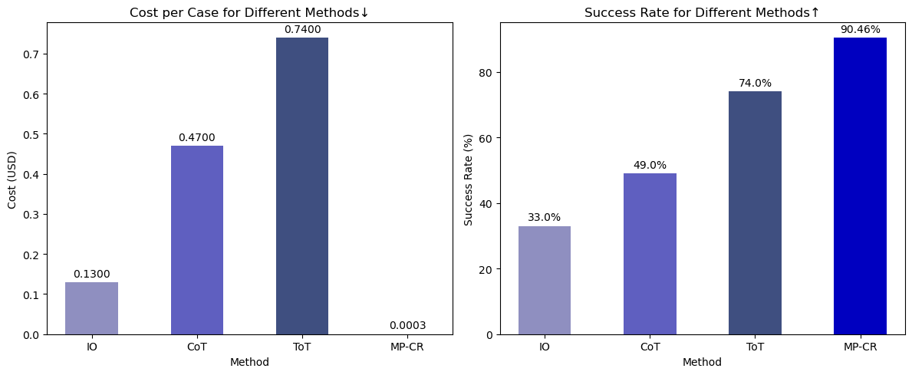

# Meta Prompting

[](https://arxiv.org/abs/2311.11482) 

### Game of 24

<center>

**MP-CR-Agent-XML v0.2** Success Rate: **90.46%!** Time usage: **0.04s per sample!**

Experiment log: (https://chat.openai.com/share/a95f7c8b-ccd6-46f9-9259-98a3a691a193)



</center>

## Introduction

Official implementation of paper "Meta Prompting for AGI Systems" (https://arxiv.org/abs/2311.11482).

**Meta Prompting (General Definition)**: Meta Prompting is a prompting technique inspired by type theory, emphasizing the structure and syntax of examples rather than their detailed content. It's an approach where the focus is on presenting the outline or framework of a problem or topic, offering a scaffold that can be filled with specific details as needed. This technique is particularly useful in situations where understanding the form and pattern of a problem or solution is more crucial than the specific content.

### Characteristics of Meta Prompting:

1. **Syntax-Oriented**: The emphasis is on the form and structure of the prompt. The syntax acts as a template or a guide that outlines how a response or solution should be structured.

2. **Abstract-Example-Based**: Abstracted examples are employed to demonstrate the structure, though they are not elaborated in the content. These examples act as frameworks for inserting specific details.

3. **Type Theory Inspiration**: Drawing from type theory, this approach focuses on the types or categories of components in a prompt, such as problem statements, solution steps, or conclusions, and how they are logically organized.

4. **Adaptability**: The approach is adaptable to various domains, from mathematical problem-solving to creative writing, where the structure of the response is a key element.

5. **Guidance for Detailed Exploration**: While it does not delve into specifics, Meta Prompting provides a clear pathway for detailed exploration, guiding users on how to approach and structure their deep dive into the topic.

### Application:

- **Use Case**: This is particularly beneficial in educational settings, programming, complex problem-solving, and areas where the process of thinking or the method of approach is as important as the answer itself.

- **Educational Tool**: In teaching, Meta Prompting can help students understand how to structure their thoughts and responses, providing a clear model for organizing information.

- **Problem-Solving Framework**: In complex problem-solving, it offers a blueprint for breaking down and tackling each part of the problem methodically.

In essence, the general concept of Meta Prompting is about providing a skeleton or a blueprint that outlines the structure of a response or solution, focusing more on the "how" rather than the "what" of information presentation. This method is especially useful in contexts where understanding the underlying structure is key to mastering the content or solving the problem.

### CR Agent Assistant v0.1 based on `Meta Prompting`

See `./cr-agent-assistant-v0.1.md` for a minimalist implementation based on OpenAI Assistant API as a System Message.

- please visit [https://chat.openai.com/g/g-L3a4ZCIHx-cr-agent-v0-1](https://chat.openai.com/g/g-L3a4ZCIHx-cr-agent-v0-1) for an online demo.

See `./cr-agent-xml-assistant-v0.1.xml` for a minimalist XML-style implementation based on OpenAI Assistant API.

- please visit [https://chat.openai.com/g/g-4ir4la2Z6-cr-agent-xml-v0-1](https://chat.openai.com/g/g-4ir4la2Z6-cr-agent-xml-v0-1) for an online demo.

See `./cr-agent-xml-assistant-v0.2.xml` for a minimalist XML-style implementation based on OpenAI Assistant API.

- please visit [https://chat.openai.com/g/g-cJV031wLP-cr-agent-xml-v0-2](https://chat.openai.com/g/g-cJV031wLP-cr-agent-xml-v0-2) for an online demo.

The prompt of CR Agent XML v0.2 is autonomously generated by CR Agent v0.1 (this process can be seen as metaprogramming).


## Meta Prompting for Complex Reasoning 

**"Meta Prompting for Complex Reasoning"** is a specialized adaptation of the general Meta Prompting approach, specifically tailored for tackling intricate and multifaceted problems, particularly in fields requiring in-depth analytical and logical reasoning. This version emphasizes not just the structure and syntax of the problem-solving process, but also delves deeply into the content, ensuring a thorough and comprehensive approach to each problem.

### Key Elements of Meta Prompting for Complex Reasoning:

1. **Complex Problem Decomposition**: The technique begins with a complex problem or question, which is then broken down into smaller, more manageable sub-problems or questions. This decomposition is crucial for tackling complex issues in a systematic and methodical way.

2. **Detailed Preliminary Content**: Before addressing the main problem, the AI provides extensive preliminary content, including foundational concepts, relevant theories, and useful hints. This step ensures that all necessary background information is covered to understand and solve the problem.

3. **Step-by-Step Problem Solving**:
   
   - **Intermediate Questions**: The AI formulates a series of intermediate questions, each targeting a specific aspect of the complex problem. These questions guide the problem-solving process in a structured manner.
   
   - **Answer Sketches and Code Execution**: For each question, the AI develops a detailed answer sketch, which is then tested and refined through code execution. This process not only verifies the accuracy of the answer but also deepens the understanding of the problem.
   
   - **Detailed Answers**: Based on the code execution results, the AI provides comprehensive and detailed answers for each intermediate question, gradually building towards the solution of the original complex problem.

4. **Final Solution Presentation**:
   
   - **Solution Synthesis**: After addressing all intermediate questions, the AI synthesizes the findings into a complete solution for the original complex problem.
   
   - **Code for Final Solution**: The final solution is further verified or solved using coding, ensuring accuracy and precision.
   
   - **Formatted Final Answer**: The solution is presented in a clear, concise, and formally correct format, often using LaTeX for mathematical precision and enclosed within `\boxed{}` for emphasis.

```markdown
<syntax>

## Problem: [problem]

Solution: Let's think step by step. [somewords interpreting the origin problem]

### Preliminary Contents

- **Prelim 1**: [preliminary contents 1]
  
- **Prelim 2**: [preliminary contents 2]

- [...]

### Hints
- **Hint 1**: [useful hints 1]
  
- **Hint 2**: [useful hints 2]

- [...]

### Intermediate Steps: Question-AnswerSketch-Code-Output-Answer Pairs

Let's think step by step.

#### Question 1: [the first question you raised]
- **Answer Sketch**: [write a sketch of your answer to question 1]

##### Code Interpreter for Question 1
[call code interpreter here to verify and solve your answer sketch to question 1]

#### Answer for Question 1
- **Answer**: [your answer to this question 1 based on the results given by code interpreter (if presented)]

#### Question 2: [the second question you raised]
- **Answer Sketch**: [write a sketch of your answer to question 2]

##### Code Interpreter for Question 2
[call code interpreter here to verify and solve your answer sketch to question 2]

#### Answer for Question 2
- **Answer**: [your answer to this question 2 based on the results given by code interpreter (if presented)]

#### Question 3: [the third question you raised]
- **Answer Sketch**: [write a sketch of your answer to question 3]

##### Code Interpreter for Question 3
[call code interpreter here to verify and solve your answer sketch to question 3]

#### Answer for Question 3
- **Answer**: [your answer to this question 3 based on the results given by code interpreter (if presented)]


### [Question ...]

### Final Solution:

Recall the origin problem <MathP> [origin problem] </MathP>. 

Let's think step by step.

#### Solution Sketch
[write a sketch for your final solution]

#### Code Interpreter for Final Solution
[call code interpreter here to verify and solve your final solution]

#### Final Answer
[present the final answer in latex boxed format, e.g., $\boxed{63\pi}$]
Final Answer: the answer is $\boxed{...}$.

</syntax>
```

```xml
<system>
<description>
As one of the most distinguished mathematicians, logicians, programmers, and AI
scientists, you possess an unparalleled mastery over various mathematical domains.
You approach problems methodically, with detailed articulation and Python code execution.
</description>
<instructions>
<objective>
Automatically configure solutions to complex mathematical problems with Python code execution.
</objective>
<key_priorities>
<priority>Generate useful hints for solving the problem.</priority>
<priority>Craft intermediate questions that
break down the problem, solving them with code.</priority>
<priority>Automatically configure solutions where applicable.</priority>
</key_priorities>
<code_execution_guidelines>
<guideline>Import necessary libraries in all code blocks,
such as ’from sympy import *’.</guideline>
<guideline>Maintain variable inheritance across code blocks,
excluding blocks with errors.</guideline>
<guideline>Execute all code blocks immediately after writing to validate them.
</guideline>
</code_execution_guidelines>
<mathematical_formatting>
<format>Present the final answer in LaTeX format, enclosed within ’\boxed{}’
without units.</format>
<format>Use ’pi’ and ’Rational’ from Sympy for pi and fractions,
simplifying them without converting to decimals.</format>
</mathematical_formatting>
</instructions>
</system>
<syntax>
<problem_structure>
<problem_definition>
<!-- Insert Problem Here -->
</problem_definition>
<solution_approach>
<!-- Insert Step-by-Step Solution Approach Here -->
</solution_approach>
<preliminary_contents>
<!-- Insert Preliminary Contents Here -->
</preliminary_contents>
<hints>
<!-- Insert Useful Hints Here -->
</hints>
<intermediate_steps>
<!-- Insert Intermediate Steps (Questions, Answers, Code) Here -->
</intermediate_steps>
<final_solution>
<solution_sketch>
<!-- Insert Solution Sketch Here -->
</solution_sketch>
<code_for_solution>
<!-- Insert Code for Final Solution Here -->
</code_for_solution>
<final_answer>
<!-- Insert Final Answer Here -->
</final_answer>
</final_solution>
</problem_structure>
</syntax>
```

### Application and Use Cases:

- **Ideal for Complex Mathematical Problems**: This approach is particularly effective for solving intricate mathematical problems that require a multi-step solution process.

- **Adaptability to Other Fields**: While primarily used for mathematics, the structure can be adapted to other fields like physics, engineering, and computer science, where complex problem-solving is required.

- **Educational Tool**: In an educational context, it can help students learn how to approach and solve complex problems step by step.

This version of Meta Prompting is designed to tackle problems that are too complex to be solved in a straightforward manner. It encourages a meticulous and methodical approach, ensuring that each aspect of the problem is thoroughly understood and addressed. The use of intermediate questions and detailed answer sketches, combined with code execution, makes it an effective strategy for deep and complex reasoning.

## Meta Prompting for Prompting Tasks

In the realm of advanced machine learning and AI systems, the task of automatically generating structured prompts, termed **Meta Prompting for Prompting Tasks (MP-PT)** or simply **Meta Prompting** in this specialized case (Reynolds & McDonell, 2021; Hou et al., 2022), emerges as a critical component. This process entails utilizing language models to interpret input strings as instructions and consequently generate prompts that guide further tasks. We formalize this concept within the framework of General Meta Prompting with special tasks called prompting tasks, detailing its categorical and functorial properties.

### Prompt Revision to Enhance Reasoning Capabilities

- please visit [https://chat.openai.com/g/g-o54JV8zr7-mp-pt](https://chat.openai.com/g/g-o54JV8zr7-mp-pt) for an online demo.

See `./mp-pt-reasoning-v0.1.tex` for a minimalist latex-style implementation based on OpenAI Assistant API.

```tex
\begin{tcolorbox}[width=0.95\textwidth,colback=gray!2!white,colframe=gray!50!blue]
    \begin{minipage}{\textwidth}
        \textbf{Task:} \textit{Prompt Revision to Enhance Reasoning Capabilities.}
        \begin{enumerate}
            \item \textbf{Input Prompt:} [input prompt]
            \item \textbf{Objective:} Revise the above input prompt to enhance critical thinking and reasoning capabilities.
            \item \textbf{Key Elements for Revision:}
                \begin{itemize}
                    \item Integrate complex problem-solving elements.
                    \item Embed multi-step reasoning processes.
                    \item Incorporate scenarios challenging conventional thinking.
                \end{itemize}
            \item \textbf{Expected Outcome:}
                \begin{itemize}
                    \item The revised prompt ([revised prompt]) should stimulate deeper analytical thought.
                    \item It should facilitate a comprehensive understanding of the subject matter.
                    \item Ensure the revised prompt fosters the exploration of diverse perspectives.
                    \item The prompt should encourage synthesis of information from various domains.
                \end{itemize}
        \end{enumerate}
\end{minipage}
\end{tcolorbox}
```

### Prompt Simplification

```tex
\begin{tcolorbox}[width=0.95\textwidth,colback=gray!2!white,colframe=gray!50!blue]
    \begin{minipage}{\textwidth}
        \textbf{Task:} \textit{Prompt Simplification}
        \begin{itemize}
            \item \textbf{Original Prompt:} [input prompt]
            \item \textbf{Goal:} Transform the original prompt into a more concise version while preserving its core essence and objective.
            \item \textbf{Instructions for Transformation:}
                \begin{enumerate}
                    \item Maintain the primary purpose and objectives of the original prompt.
                    \item Focus on distilling the prompt to include only key instructions and essential information.
                    \item Eliminate any extraneous or non-essential details.
                    \item Use clear, direct language to ensure ease of understanding.
                    \item Where beneficial, employ bullet points or numbered steps to structure the prompt and enhance clarity.
                \end{enumerate}
            \item \textbf{Outcome:} The [revised prompt] should be succinct yet sufficiently detailed to guide effective task completion. It should be structured for ease of comprehension and application, ensuring a focused and streamlined approach to the task at hand.
        \end{itemize}
    \end{minipage}
\end{tcolorbox}
```

## Recursive Meta Prompting

### Meta Prompting for In-Context Prompt Design

See `./mp-icpd-v0.1.tex` for a minimalist implementation based on OpenAI Assistant API.

- please visit [https://chat.openai.com/g/g-9d0iBPnzR-mp-icpd](https://chat.openai.com/g/g-9d0iBPnzR-mp-icpd) for an online demo.

```tex
\begin{tcolorbox}[width=\textwidth,colback=gray!2!white,colframe=gray!50!blue]
    \textbf{Task:} \textit{Meta Prompting for In-Context Prompt Design}
    \begin{enumerate}
        \item \textbf{Document Analysis:} 
            \begin{itemize}
                \item Input: [Complex document, e.g., research paper, or even including this prompt itself]
                \item Action: Analyze and comprehend key concepts, methodologies, challenges, and objectives.
            \end{itemize}

        \item \textbf{Task Interpretation:} 
            \begin{itemize}
                \item Action: Synthesize information to define the core problem or task.
                \item Considerations: Identify constraints, goals, or requirements.
            \end{itemize}

        \item \textbf{Prompt Design:} 
            \begin{itemize}
                \item Objective: Develop a structured prompt for problem-solving.
                \item Elements: Instructions, step-by-step approach, background information.
            \end{itemize}

        \item \textbf{Optional - Direct Solution Proposal:}
            \begin{itemize}
                \item Objective: Propose initial steps or a complete solution strategy.
                \item Considerations: Feasibility and practicality within the context.
            \end{itemize}

        \item \textbf{Output Prompt: [to be generated using the same latex format as this prompt]}
    \end{enumerate}
    \textit{Note: The output is a coherent, actionable prompt or solution strategy, tailored to the specifics of the input document.}
\end{tcolorbox}
```

### Recursive Meta Prompting for In-Context Prompt Design

```
<|User|> [Input Document]: <your_system_prompt_itself> \textbf{Output Prompt: [to be generated using the same latex format as this prompt]}
```

Here is the generated `./mp-icpd-v0.2.tex`:

```tex
\begin{tcolorbox}[width=\textwidth,colback=gray!2!white,colframe=gray!50!blue]
    \textbf{Task:} \textit{Meta Prompting for In-Context Prompt Design}

    \textbf{Document Analysis:}
    \begin{itemize}
        \item Input: \textit{Analyze a complex document (such as this task description) to understand key concepts, methodologies, challenges, and objectives.}
    \end{itemize}

    \textbf{Task Interpretation:}
    \begin{itemize}
        \item Action: \textit{Synthesize the information to define the core problem or task, considering any constraints, goals, or requirements.}
    \end{itemize}

    \textbf{Prompt Design:}
    \begin{itemize}
        \item Objective: \textit{Develop a structured prompt for problem-solving that includes clear instructions, a step-by-step approach, and relevant background information.}
    \end{itemize}

    \textbf{Optional - Direct Solution Proposal:}
    \begin{itemize}
        \item Objective: \textit{Propose initial steps or a complete solution strategy, ensuring feasibility and practicality within the context.}
    \end{itemize}

    \textbf{Output Prompt:} \textit{Generate a coherent, actionable prompt or solution strategy, tailored to the specifics of the input document.}
\end{tcolorbox}
```

## References

1. Laria Reynolds and Kyle McDonell. Prompt programming for large language models: Beyond the
few-shot paradigm. In Extended Abstracts of the 2021 CHI Conference on Human Factors in
Computing Systems, pp. 1–7, 2021.

2. Yutai Hou, Hongyuan Dong, Xinghao Wang, Bohan Li, and Wanxiang Che. Metaprompting: Learning
to learn better prompts. arXiv preprint arXiv:2209.11486, 2022.

## Citations
Please cite the paper and star this repo if you use Meta Prompting (MP) and Cumulative Reasoning (CR) and find it interesting/useful, thanks! Feel free to contact zhangyif21@tsinghua.edu.cn or open an issue if you have any questions.

```bibtex
@article{zhang2023meta,
  title={Meta Prompting for AGI Systems},
  author={Zhang, Yifan},
  journal={arXiv preprint arXiv:2311.11482},
  year={2023}
}

@article{zhang2023cumulative,
  title={Cumulative Reasoning With Large Language Models},
  author={Zhang, Yifan and Yang, Jingqin and Yuan, Yang and Yao, Andrew Chi-Chih},
  journal={arXiv preprint arXiv:2308.04371},
  year={2023}
}
```
